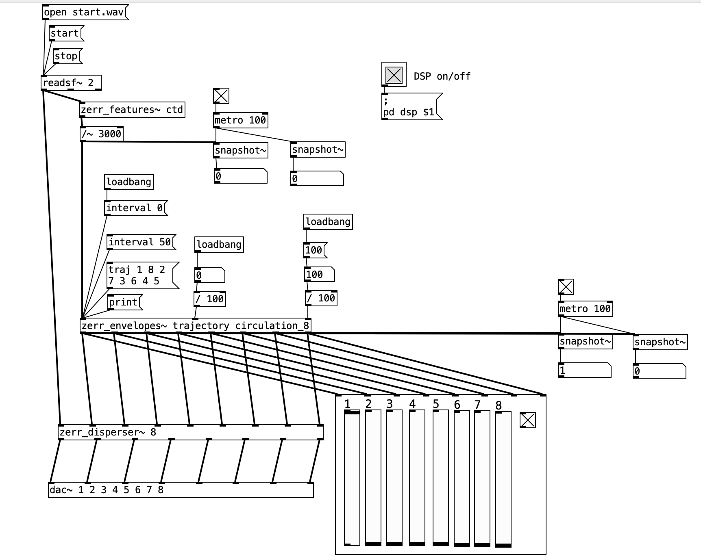

# Found in Noise: Final Project Documentation of Spatial Audio II
 
*An Autogenous Multichannel Fixed-Media Composition*
 
**Author:** Xinni Li, Canting Zhu

**Date:** 2026-05-01

**Project Materials:**
- 🎬 [Setup & process video](https://drive.google.com/file/d/1D1LflKJ_ksnrdm2uL1q-FVpZZ3-W3Rm4/view?usp=sharing)
- 🎧 [Audio file(Binaural)](https://drive.google.com/file/d/1A7ic5gQJcWh8YDq5pvndJBrrqIevXWBv/view?usp=sharing)
 
## Inspiration

The primary inspiration for our project comes from Alvin Lucier’s work [*I Am Sitting in a Room* (1969)](https://www.youtube.com/watch?v=bhtO4DsSazc&list=RDbhtO4DsSazc&start_radio=1).
In Lucier’s creative process, he sat in a room holding a tape recorder and a microphone, recording himself reading a short text. The text begins: "I am sitting in a room, different from the one you are in now. I am recording the sound of my speaking voice..." He then played this recording back into the same room through a loudspeaker and used the microphone to record it onto a second tape. Next, he played this second tape back into the room and recorded a third tape. He repeated this process 32 times. Throughout the entire playback of this piece, what you hear is a slow evolution. In the initial generations of recordings, his voice is clearly discernible. However, with each cycle of playback within the room, the room's inherent resonant frequencies become slightly stronger, while those frequencies absorbed by the room become slightly weaker. By around the 10th generation, the words begin to blur. By the 20th generation, the words have vanished entirely—the consonantal elements have completely dissolved, leaving behind only a humming stream of sound filled with specific pitches. In the final generation of recordings, no trace of speech remains; all that is left is the room itself.

The conceptual intent underlying this work is rooted in process-based sound art. In this context, the room itself acts as the true "composer." Each room possesses unique acoustic characteristics, collectively determined by its dimensions, materials, and geometry. Typically, we are unable to directly perceive this distinct acoustic signature, as it is invariably masked by the various active sound sources present within the room. The creative methodology employed by Lucier was specifically designed to enable the room to "hear" its own voice. Through this recursive process, the human voice is gradually filtered out. Ultimately, only the room's own pure sound remains. Our project extends this concept beyond the context of mono audio to a spatial audio environment.

## Concept

The core concept of this project is the combination of temporal iteration and spatial transformation. Like Lucier's original process, we employ repeated cycles of playback and recording. However, instead of maintaining a fixed channel format, each iteration introduces spatialization across an eight-speaker system.

Drawing on Denis Smalley's notion of "space-form" — the shaping of spatial experience through the acousmatic presentation of sound — our system treats the speaker array not merely as a reproduction medium but as an active compositional element. In this framework, sound is not only filtered by the room but also reconfigured in space during each iteration. The system effectively becomes a feedback loop in which spatial encoding, acoustic propagation, and recording continuously interact.
The iterative process can be understood through the lens of spectromorphology: each generation undergoes spectral and morphological transformation as the room's acoustic properties selectively reinforce certain frequencies while attenuating others. As a result, the final output reflects not only the resonant characteristics of the room but also the structural influence of the speaker arrangement and spatial processing. What Jonty Harrison describes as changes in "spatial density" becomes audible across generations — the concentrated energy of the original source material gradually disperses and reconcentrates according to the room's modal behavior and the spatial logic of the array.

The project is implemented in PureData, with the Zerr~ externals handling the spatialization. In our patch, the input audio is continuously analyzed for its spectral centroid — a descriptor that tracks the "center of mass" of the sound's frequency content over time. This single feature drives the entire spatial response: the centroid value controls a set of eight gain envelopes, one per speaker, which together determine how the sound is dispersed across the array. Bright, spectrally unstable input activates multiple envelopes at once and spreads the sound across many speakers; stable input produces sparse envelope activity and focuses the sound to fewer points. No manual panning is involved.

We also customized two parameters that shape the character of the spatial movement. A custom trajectory ordering (1 8 2 7 3 6 4 5) pairs opposite speakers rather than walking them sequentially, so the sound leaps across the room instead of orbiting the listener. A topological "neighbor graph" defines which speakers are considered logically adjacent — independent of their physical positions — and the spatial trajectory walks this graph, producing non-circular, almost teleporting motion.

## Implementation

A single microphone is placed at the center of the listening space to capture the combined acoustic output of all eight speakers. The signal flow begins with a 30-second stereo source, which is loaded into Pure Data and spatialized across eight channels via the Zerr patch. This eight-channel output is played through the speaker array, propagates through the room, and is captured by the microphone. The microphone signal is recorded into Reaper, where it is exported as a new stereo file and re-imported into Pure Data as the source for the next iteration. This recursive cycle is repeated six times and each generation produces roughly 30 seconds of recorded material. An important aspect of the implementation is the interaction between multiple propagation paths. Once all six recordings are complete, they are assembled in Reaper by concatenating the generations in chronological order. The final output is a binaural stereo file of approximately three minutes, in which the listener hears the same source material gradually transformed across six successive passes through the patch and the room.

## Results

We noticed that, as the number of iterations increases, the original content becomes progressively less recognizable. As in Lucier's I Am Sitting in a Room, intelligible musical features begin to dissolve, replaced by sustained tones and resonant textures. However, in this spatial context, the transformation is not purely spectral but also spatial: certain directions within the speaker array begin to dominate perceptually, and the accumulation of phase interactions and interference patterns across multiple channels produces a richer, more complex frequency response than would be expected in a mono or stereo system. 

Across the six iterations we conducted, we observed a distinct low-frequency shift in the spectrum. As the iterative process progressed, low-frequency components gradually came to dominate, while mid- and high-frequency components decayed rapidly. For instance, by the second generation, sounds with frequencies exceeding 1500 Hz had already all but vanished. By the final few generations, the output signal consisted almost entirely of low frequencies. Auditorily, it had transformed into a rumbling sound.

We hypothesize that this is the result of the combined effects of several factors:

1. The source material. Unlike Lucier's spoken voice — which has a relatively balanced spectral distribution and relies on mid and high frequencies for intelligibility — our initial source consisted primarily of drums, bass, and a small amount of lead synthesizer. Low-frequency energy was already dominant at Generation 0, particularly through sustained bass elements. In an iterative system, frequencies with greater initial energy and temporal stability are more likely to persist and be reinforced across generations, so this imbalance compounded rather than corrected itself.

2. Room acoustics. Lower frequencies are less readily absorbed by typical room materials and sustain longer in an enclosed space, allowing them to accumulate across repeated playback and recording cycles. Higher frequencies, by contrast, are more easily absorbed and scattered, and tend to be lost over successive iterations.

3. The multi-speaker configuration. Slight phase misalignments and interference between the eight speakers disproportionately affect higher frequencies — short wavelengths are more sensitive to small spatial offsets, causing cancellation and diffusion. Lower frequencies, with their longer wavelengths, remain more spatially stable and coherent across the array.

Overall, our findings suggest that the system reveals not only the resonant characteristics of the room, but also biases embedded in both the source material and the spatial playback configuration. The final output can therefore be understood as a convergence of three layers — spectral weighting in the source, acoustic persistence in the room, and spatial behavior of the speaker array — all pulling in the same direction. The iterative process acts not only as a probe of spatial resonance, but as a mechanism that reveals and exaggerates inherent spectral biases at every stage of the chain.

## References
- [Lucier, Alvin. *I Am Sitting in a Room*. 1969.](https://www.youtube.com/watch?v=bhtO4DsSazc&list=RDbhtO4DsSazc&start_radio=1)
- Smalley, Denis. "Space-Form and the Acousmatic Image." Organised Sound 12, no. 1 (2007): 35–58.
- Smalley, Denis. "Spectromorphology: Explaining Sound-Shapes." Organised Sound 2, no. 2 (1997): 107–126.
- Harrison, Jonty. "Sound, Space, Sculpture: Some Thoughts on the 'What', 'How' and 'Why' of Sound Diffusion." Organised Sound 3, no. 2 (1998): 117–127.
- [Ferrari, Luc. *Presque Rien n°1*](https://www.youtube.com/watch?v=8C6XlF_2VrQ)

